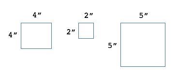

# `03` Calling a Function

`Functions` are **blocks of code** that you save to be (re)used later; that specific fragment of code has a predefined purpose and it does a defined task. A `function` could receive some or no parameters to be able to execute, and must always return something.

For example: a function that calculates the area of a square would be something like this:

```js
function calculateArea(length, width) {
    return length * width;
}
```

If you want to use that `function` to calculate the area of a square with

```js
length = 6
width = 3
```

You need to do something like this:

```js
let squareArea = calculateArea(6, 3);
```
The value of `squareArea` will be set to `18`.

## 📝 Instructions:

1. Create a new variable named `squareArea` for each new iteration of the `calculateArea` function using the dimensions of the following figures:

 

## 📎 Example:

For the first figure:

```js
let squareArea1 = calculateArea(4, 4);
```

For the second figure:

```js
let squareArea2 = functionCall(x, y);
```

## 💡 Hints:

+ Call the `calculateArea` function 3 times, one per each square, passing the length and width of each square.

+ Click here to learn more about functions: [http://www.mathopenref.com/functionsprog.html](http://www.mathopenref.com/functionsprog.html)
